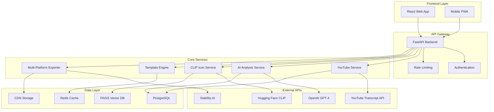

# YouTube-to-Infographic SaaS: High-Level Design (HLD)

[](https://github.com/arunprasadd/ytnew)
[](#tech-stack)
[](#development-status)

## 📋 Table of Contents

- [Overview](#overview)
- [System Architecture](#system-architecture)
- [Core Components](#core-components)
- [Data Flow](#data-flow)
- [CLIP-Based Icon Matching](#clip-based-icon-matching)
- [Template Management System](#template-management-system)
- [Multi-Platform Export System](#multi-platform-export-system)
- [API Specifications](#api-specifications)
- [Database Design](#database-design)
- [Tech Stack](#tech-stack)
- [Implementation Phases](#implementation-phases)
- [Performance Requirements](#performance-requirements)
- [Security Considerations](#security-considerations)
- [Deployment Architecture](#deployment-architecture)
- [Success Metrics](#success-metrics)
- [Development Roadmap](#development-roadmap)

---

## 🎯 Overview

### Project Vision
Transform any YouTube video into professional, shareable infographics optimized for multiple social media platforms in under 60 seconds using AI-powered content analysis and visual-semantic icon matching.

### Key Value Propositions
- **Time Efficiency**: Reduce infographic creation from 9-12 hours to 60 seconds
- **AI Automation**: Intelligent content extraction and visual design
- **Visual-Semantic Matching**: CLIP-based icon selection that understands content meaning
- **Multi-Platform Export**: Generate 25+ social media formats automatically
- **Professional Quality**: Compete with expensive design tools at fraction of the cost
- **Brand Integration**: Easy customization for business users

### Target Market
- Content marketers and social media managers
- Educational content creators
- Business professionals creating presentations
- YouTubers repurposing video content
- Agencies creating client materials

---

## 🏗️ System Architecture



---

## 🔧 Core Components

### 1. Frontend Application (React)
**Purpose**: User interface and experience

**Key Features**:
- **URL Input System**: YouTube link validation and metadata preview
- **Template Gallery**: Browse and select from 25+ professional templates
- **Platform Selector**: Choose social media formats for export
- **Real-time Preview**: Live infographic preview with edit capabilities
- **Export Dashboard**: Multi-platform download center
- **User Dashboard**: Account management, saved designs, usage analytics

**Technical Implementation**:
```jsx
// Core component structure
src/
├── components/
│   ├── forms/YouTubeUrlForm.jsx
│   ├── templates/TemplateGallery.jsx
│   ├── platforms/PlatformSelector.jsx
│   ├── preview/InfographicPreview.jsx
│   └── dashboard/ExportCenter.jsx
├── services/api.js
├── hooks/useInfographicGeneration.js
└── utils/validation.js
```

### 2. Backend API (FastAPI)
**Purpose**: Business logic orchestration and API management

**Core Endpoints**:
```python
# Transcript Processing
POST /api/extract-transcript
GET  /api/transcript/{video_id}

# Content Analysis
POST /api/generate-bullet-points
POST /api/analyze-content

# Template Management
GET  /api/templates                           # Get all available templates
GET  /api/templates/categories                # Get template categories
GET  /api/templates/{template_id}             # Get specific template details
GET  /api/templates/{template_id}/layout      # Get template coordinate layout
GET  /api/templates/{template_id}/preview     # Get template preview image
POST /api/templates/{template_id}/validate    # Validate content fits template
GET  /api/templates/{template_id}/platforms   # Get supported platforms for template

# Social Media Platforms
GET  /api/platforms                           # Get all supported social media platforms
GET  /api/platforms/{platform}/specs          # Get platform specifications
POST /api/platforms/bulk-specs                # Get specs for multiple platforms

# Icon Matching
GET  /api/icons/search
POST /api/icons/search-for-bullet-points

# Infographic Generation
POST /api/generate-infographic                # Generate primary infographic
GET  /api/infographic/{id}/status
GET  /api/infographic/{id}/download
POST /api/infographic/preview                 # Generate preview with selected template

# Multi-Platform Export
POST /api/infographic/{id}/export-platforms   # Generate exports for selected platforms
GET  /api/infographic/{id}/exports            # Get all available exports
GET  /api/infographic/{id}/export/{platform}  # Download specific platform export
POST /api/infographic/{id}/export-all         # Generate exports for all supported platforms
GET  /api/infographic/{id}/export-status      # Check export generation status

# User Management
POST /api/auth/login
GET  /api/user/dashboard
GET  /api/user/exports                        # User's export history
```

### 3. YouTube Transcript Service
**Purpose**: Extract and clean video transcripts using youtube-transcript-api

**Implementation**:
```python
from youtube_transcript_api import YouTubeTranscriptApi
from youtube_transcript_api.formatters import TextFormatter
import re
from typing import Dict, List, Optional

class YouTubeService:
    def __init__(self):
        self.formatter = TextFormatter()
    
    def extract_video_id(self, url: str) -> Optional[str]:
        """Extract video ID from various YouTube URL formats"""
        patterns = [
            r'(?:youtube\.com\/watch\?v=|youtu\.be\/|youtube\.com\/embed\/)([^&\n?#]+)',
            r'youtube\.com\/watch\?.*v=([^&\n?#]+)'
        ]
        
        for pattern in patterns:
            match = re.search(pattern, url)
            if match:
                return match.group(1)
        return None
    
    def get_transcript(self, video_id: str, languages: List[str] = ['en']) -> Dict:
        """Get transcript using youtube-transcript-api"""
        try:
            # Get transcript using youtube-transcript-api
            transcript = YouTubeTranscriptApi.get_transcript(video_id, languages=languages)
            
            # Format raw transcript
            raw_text = self.formatter.format_transcript(transcript)
            
            # Clean transcript
            cleaned_text = self.clean_transcript(raw_text)
            
            # Calculate metadata
            word_count = len(cleaned_text.split())
            duration = self.calculate_duration(transcript)
            
            return {
                "success": True,
                "raw_transcript": raw_text,
                "cleaned_transcript": cleaned_text,
                "transcript_segments": transcript,
                "metadata": {
                    "word_count": word_count,
                    "duration": duration,
                    "language": languages[0],
                    "segment_count": len(transcript)
                }
            }
            
        except Exception as e:
            return {
                "success": False,
                "error": str(e),
                "message": "Could not extract transcript. Video may not have captions available."
            }
    
    def clean_transcript(self, raw_text: str) -> str:
        """Clean and format transcript text"""
        # Remove excessive whitespace
        text = re.sub(r'\s+', ' ', raw_text)
        
        # Remove filler words
        filler_words = ['um', 'uh', 'like', 'you know', 'so like', 'i mean']
        for filler in filler_words:
            text = re.sub(rf'\b{filler}\b', '', text, flags=re.IGNORECASE)
        
        # Clean up extra spaces
        text = re.sub(r'\s+', ' ', text).strip()
        return text
    
    def calculate_duration(self, transcript: List[Dict]) -> str:
        """Calculate video duration from transcript segments"""
        if not transcript:
            return "00:00"
        
        last_segment = transcript[-1]
        total_seconds = int(last_segment.get('start', 0) + last_segment.get('duration', 0))
        
        minutes = total_seconds // 60
        seconds = total_seconds % 60
        
        return f"{minutes:02d}:{seconds:02d}"
```

**youtube-transcript-api Features**:
- Support for multiple YouTube URL formats
- Auto-generated and manual caption extraction using YouTubeTranscriptApi.get_transcript()
- Multi-language support with language preference fallback
- Text cleaning and normalization post-processing
- Error handling for restricted/private videos and missing captions
- Transcript formatting with TextFormatter for clean output

### 4. AI Content Analysis Service
**Purpose**: Extract key insights and bullet points from transcript

**Implementation**:
```python
class AIService:
    def generate_bullet_points(
        self, 
        transcript: str, 
        video_title: str,
        style_preference: str,
        target_audience: str
    ) -> Dict
    
    def generate_visual_specs(
        self, 
        bullet_points: List[Dict], 
        brand_colors: List[str]
    ) -> Dict
```

**AI Prompting Strategy**:
```
SYSTEM: You are an expert content analyst specializing in converting video 
transcripts into compelling infographic bullet points.

EXTRACTION CRITERIA:
- 4-5 key points maximum
- Visually representable with icons
- Actionable or highly informative
- Concise (max 15 words each)
- Social media optimized

OUTPUT FORMAT: Structured JSON with bullet points, categories, and icon keywords
```

### 5. CLIP-Based Icon Matching Service
**Purpose**: Visual-semantic icon search using AI vision models

**Architecture**:
```python
class ClipIconProcessor:
    def process_icon(self, image_path: Path) -> Tuple[Metadata, np.ndarray]
    def build_faiss_index(self, embeddings: np.ndarray) -> faiss.Index
    
class ClipIconSearchService:
    def search_icons_by_text(self, query_text: str) -> List[Dict]
    def search_icons_for_bullet_points(self, bullet_points: List[Dict]) ->